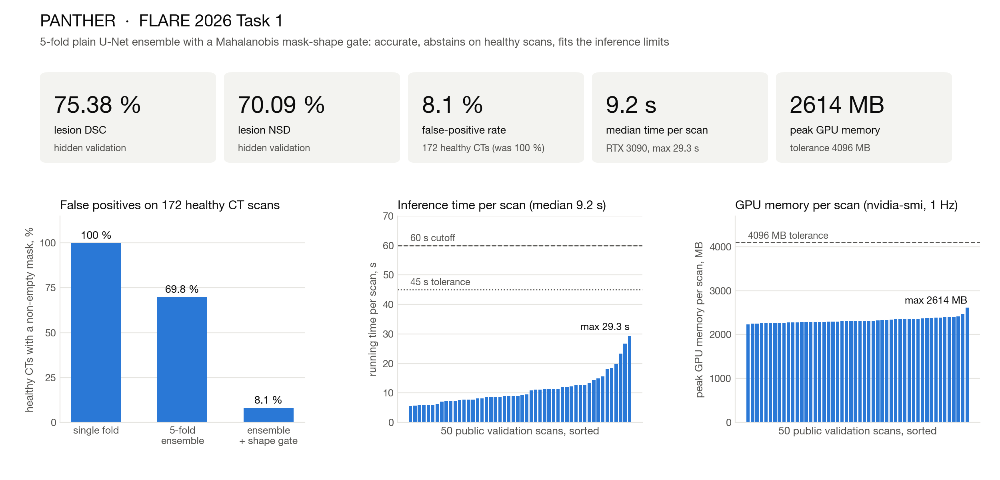
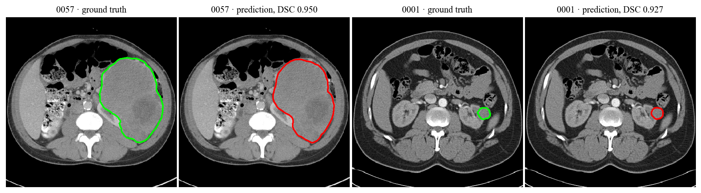

# PANTHER: PAN-cancer CT Segmentation with Two-tier Healthy-scan Ensemble Rejection



Code and weights for our MICCAI 2026 FLARE Challenge Task 1 submission (team
jehb4ik). The submitted Docker image is a 5-fold plain U-Net ensemble
(nnU-Net v2.8.1) trained on the per-source capped `Dataset500_FLAREPanCancer`
subset (8762 CT scans) with a post-hoc Mahalanobis mask-shape gate fitted on
172 healthy CT scans. Project page with an interactive slice viewer:
`docs/index.html` (GitHub Pages).

Repository layout:

```
training/     Dataset500 manifest and downloader, nnU-Net plan, trainer, preprocessing script
maha_gate/    Mahalanobis shape-gate fit and the fitted parameters
docker/       the submitted inference container and the timed sanity-test script
evaluation/   DSC and NSD (2 mm) computation
docs/         figures, figure scripts, HuggingFace model card, project page
```

## Environments and Requirements

| | |
|---|---|
| OS | Ubuntu 22.04 LTS |
| CPU | AMD EPYC 9354 (32 vCPUs allocated) |
| RAM | 512 GB host; 28 GB container limit at inference |
| GPU | training: 1 NVIDIA H100 80 GB; container test: 1 NVIDIA RTX 3090 24 GB |
| CUDA | 11.8 |
| Python | 3.11 |
| Framework | PyTorch 2.5.1 (cu118), nnunetv2 2.8.1 |

Local scripts (data download, preprocessing helper, gate fit, evaluation, figures):

```bash
pip install -r requirements.txt
```

The inference container installs its own pinned dependencies (`docker/Dockerfile`).

## Dataset

FLARE 2026 Task 1 data: https://huggingface.co/datasets/FLARE-MedFM/PancancerCTSeg
(registration on the challenge is required for access). Training uses
17 575 labelled CT scans with partial tumour labels; validation uses 50 public
scans with labels, 100 hidden scans (Codabench) and 172 healthy scans.

We train on `Dataset500`, a per-source capped subset of 8762 scans: large
sources are capped, rare ones kept in full (28 source datasets, 11 anatomical
groups; composition table in `training/README.md`). The exact file list is
`training/Dataset500_manifest.json`.

```bash
export HF_TOKEN=...
python training/reproduce_dataset500.py --root /data/flare26      # ~350 GB, nnU-Net raw layout
python training/download_validation.py  --root /data/flare26      # ~25 GB; --subset public|hidden|healthy
```

Resulting layout:

```
/data/flare26/nnUNet_raw/Dataset500_FLAREPanCancer/{imagesTr,labelsTr,dataset.json}
/data/flare26/validation/{Validation-Public-Images,Validation-Public-Labels,Validation-Hidden-Images,HealthyImages-noLesion}
```

## Preprocessing

nnU-Net preprocessing with the shipped plan `training/nnUNetPlans_tr.json`:
labels reduced to {background, lesion}; target spacing 2.0 x 1.5 x 1.5 mm
(z, y, x), set manually (median spacing of the training set is
2.5 x 0.78 x 0.78 mm); torch resampling (`resample_torch_fornnunet`); CT
normalisation (clipping to the 0.5/99.5 foreground percentiles, z-score).
Non-orthonormal NIfTI direction matrices (13 of 8762 volumes) are repaired at
load time by SVD (`docker/predict.py`, `orthonormalize`).

```bash
./training/preprocess_dataset500.sh /data/flare26   # fingerprint + preprocess, do not run nnUNetv2_plan_experiment
```

## Training

Five folds of plain U-Net (3d_fullres, patch 96 x 160 x 160, batch 2, 5000
epochs, SGD with Nesterov momentum 0.99, initial lr 1e-3, PolyLR, Dice + CE,
default nnU-Net augmentation). About 72 h per fold on one H100.

```bash
cp training/nnUNetTrainer_Epoch5000_Lr1e3.py \
   $(python -c 'import nnunetv2, os; print(os.path.dirname(nnunetv2.__file__))')/training/nnUNetTrainer/variants/training_length/
export nnUNet_raw=/data/flare26/nnUNet_raw nnUNet_preprocessed=/data/flare26/nnUNet_preprocessed nnUNet_results=/data/flare26/nnUNet_results
for f in 0 1 2 3 4; do
  nnUNetv2_train 500 3d_fullres $f -tr nnUNetTrainer_Epoch5000_Lr1e3 -p nnUNetPlans_tr --npz
done
```

Mahalanobis shape gate (after predicting the 172 healthy and 50 public scans
with the ensemble):

```bash
python maha_gate/fit_mahalanobis_gate.py \
  --pred-healthy <healthy masks> --ct-healthy /data/flare26/validation/HealthyImages-noLesion \
  --pred-public  <public masks>  --ct-public  /data/flare26/validation/Validation-Public-Images \
  --out-gate docker/maha_gate.json
```

No pre-trained models were used; unlabeled images were not used.

## Trained Models

The five checkpoints (236 MB each), `plans.json` and `dataset.json`:
https://huggingface.co/jehb4ik/PANTHER-FLARE2026

```bash
python -c "from huggingface_hub import snapshot_download; snapshot_download('jehb4ik/PANTHER-FLARE2026', local_dir='docker/model')"
```

## Inference

Build and run the submitted container (input `<case>_0000.nii.gz`, output
`<case>.nii.gz`):

```bash
cd docker
./build.sh jehb4ik:latest
./test.sh  jehb4ik:latest /path/to/inputs /path/to/outputs
```

The organisers' command is `docker run --rm --gpus device=0 -m 28G -v <in>:/workspace/inputs/ -v <out>:/workspace/outputs/ jehb4ik:latest /bin/bash -c "sh predict.sh"`.
`docker/run_sanity.sh` reproduces the timed run with a 1 Hz GPU-memory log.
Inference options (folds, sliding-window step, gates) are environment
variables listed in `docker/README.md`.

## Evaluation

Lesion DSC and NSD with a 2 mm tolerance, as in the challenge:

```bash
python evaluation/evaluate.py --gt /data/flare26/validation/Validation-Public-Labels --pred /path/to/outputs --csv per_case.csv
```

## Results

Hidden validation (100 CT scans, Codabench) and false positives on the 172 healthy scans:

| Configuration | DSC (%) | NSD (%) | FPR on healthy |
|---|---:|---:|---:|
| Single fold, plain U-Net | 72.63 | 67.42 | 100 % |
| 5-fold ensemble, plain U-Net | 75.38 | 70.09 | 69.8 % |
| 5-fold ensemble + Mahalanobis gate (submitted) | 75.38 | 70.09 | 8.1 % |

Efficiency of the submitted image on the 50 public validation scans
(RTX 3090, `-m 28G`, default `--shm-size`): 5.6 / 9.2 / 11.1 / 29.3 s per
scan (min / median / mean / max), peak GPU memory 2614 MB, no failures.

Challenge: https://www.codabench.org/competitions/7149/

Best public validation cases by Dice, ground truth (green) versus the
prediction of the submitted image (red):



Figures are regenerated with `docs/make_hero.py` (from `sanity.cast` and the
nvidia-smi log) and `docs/make_showcase.py --images <CT dir> --labels <GT dir> --pred <mask dir> --top N`.

## Contributing

Issues and pull requests are welcome. For questions or collaboration write to
przhezdzetskaia@axxx.tech.

## Acknowledgement

We thank the FLARE 2026 organisers and all data owners for the CT scans, and
Codabench for hosting the challenge. The model is built on
[nnU-Net](https://github.com/MIC-DKFZ/nnUNet).

## Citation

Przhezdzetskaia E., Baranov V., Khazova M., Gombolevskiy V. PANTHER: PAN-cancer
CT Segmentation with Two-tier Healthy-scan Ensemble Rejection. MICCAI 2026
FLARE Challenge, Task 1 submission.

## License

Apache License 2.0 (see `LICENSE`).
